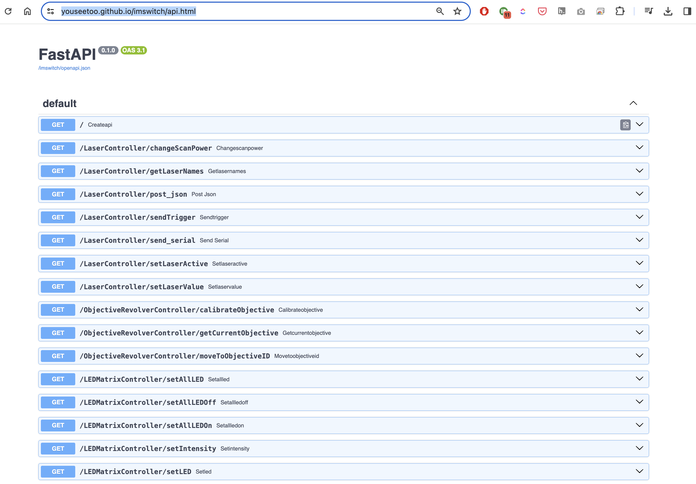

# Hackathon: LLM in Microscopy using UC2

This repository will give you information on:
- How to install ImSwitch
- How to interact with the Fastapi of Imswitch
- What's the UC2 hardware used for the challenge
- The challenge to solve with the microscope

## Installing ImSwitch

### General Installatoin
Please also refer to the long README here https://github.com/openUC2/ImSwitch/ to learn how to install ImSwitch.


### ImSwitch Installer
For Windows and Mac, you should be able to use the Installer; Use the latest release here https://github.com/openUC2/ImSwitchInstaller/releases

It will install ImSwitch under you `username` and then in the folder `ImSwitch`. It will also create a miniforge/mamba environment. All packages are installed in the base environment.
A good thing: You can use this environemnt for debugging and changing code. The paths are the following (assuming username is `bene`)

**Windows Installation Path:** `C:\Users\UCadmin2\ImSwitch\miniforge\condabin`
- **Python Executable:** `C:\\Users\\UCadmin2\\ImSwitch\\miniforge\\python.exe`
- **ImSwitch Package Location:** `C:\\Users\\UCadmin2\\ImSwitch\\miniforge\\lib\\site-packages\\imswitch\\__init__.py'`


**Mac Installation Path:** `/Users/bene/ImSwitch/miniforge/bin/`
- **Python Executable:** `/Users/bene/ImSwitch/miniforge/bin/python`
- **ImSwitch Package Location:** `/Users/bene/ImSwitch/miniforge/lib/python3.10/site-packages/imswitch/__init__.py'`

## Debugging setup:

I use Visual Studio code and configure it the following way:

1. Open a new folder -> ImSwitch folder
2. Navigate to `main.py`
3. Install the Python extension and Python environment extension
4. Select the interpreter with the miniforge Python executable
5. Launch ImSwitch in Debug or in non-Debug mode


## Hardware

For the hackathon we will use the "UC2" XYZ microscope ([Github](https://github.com/openUC2/openUC2_XYZ_Stagescanning_Microscope)) or soon the [openUC2 FiveD](https://openuc2.com/fived/)

**Features:**

- Daheng Galaxy IMX226 camera
- UC2-ESP32 that runs the stepper motors, LEDs, etc. => UC2-REST [Python library](https://github.com/openUC2/UC2-REST/)
- Theoretical step-size/resolution is ~300nm
- Stage scanning region ca. 70x110mm and +/- 5mm in Z
- Homing switches to zero the position
- Brightfield illumination
- Fluorescence Slot is empty for this hackathon

Some images from the stage (probably without the on-stage incubator)


*Stationary optics and XYZ-movable stage*


*Fully 3D printed - metal parts where necessary*


*Fully automated using ImSwitch*


### Positioner/Stages

You can get the positioner and move it inside the plugin code like so:

```py
self.positioner.move(value=(self.xScanMin+self.initialPosition[0],self.yScanMin+self.initialPosition[1]), axis="XY", is_absolute=True, is_blocking=True)
```

### Detector/Camera

You can get the detector and capture a numpy image in the plugin code like so

```py
allDetectorNames = self._master.detectorsManager.getAllDeviceNames()
self.detector = self._master.detectorsManager[allDetectorNames[0]]
mImage = self.detector.getLatestFrame()
```

## REST Api from ImSwitch

ImSwitch, once started, features a fully fledged REST-Api interface using fastapi. MAny functions inside the backend are exposed to the public API using the `@ApiExport` decorator.

You can access a statically hosted API description here https://youseetoo.github.io/imswitch/api.html
It is dynamically generated on ImSwitchs' boot-up




You can interact with the HTTP-requests with the python `requests` library. A simple python wrapper can be found as a pip package:
https://github.com/openUC2/imswitchclient

It's very experimental, but could help you integrate ImSwitch into your Jupyter Notebook.

## ImSwitch Plugin System

Recently we have started putting up a plugin system for ImSwitch. It'S in a very early stage, but should solve the following issues:

- better seperate user code from ImSwitch code base
- reduce memory footprint of ImSwitch
- make updates more incremental
- engage communtiy by providing smart microscpy snippets

We have created a simple cookie-cutter template that is available here:
https://github.com/openUC2/cookiecutter-imswitch

The OpenUC2 version of ImSwitch can already deal with these plugins. We have a sample plugin that creates a widget and the corresponding controller that can access. e.g. the stage and file requests to the FLIMLabs card https://github.com/openUC2/cookiecutter-imswitch

### Overview

The plugin has a `widget` and a `controller` (soon also the `manager`).

#### Widget

The `widget` essentially represents all necessary control elements in the form of a PyQT application. If ImSwitch is installed you can access all the signals from the event loop as it's dynanmically imported on startup. The example code can be found here:
https://github.com/openUC2/imswitch-flimlabs/blob/main/src/imswitch_flimlabs/imswitch_flimlabs_widget.py


##### Controller

The controller (for example) derives the `XXX_controller(ImConWidgetController)` and has access to all managers and control signals. You can wire the gui elements to actions or e.g. do online processing of incoming frames from the detector. A sample implementation can be found here:
https://github.com/openUC2/imswitch-flimlabs/blob/main/src/imswitch_flimlabs/imswitch_flimlabs_controller.py


## The Challenge

We thought it would be fun to think about a microscopy and sample-independent challenge. A maze would be the perfect object to test the "smartness" of the microscope. Therefore, we set the challenge - find the way out!
We printed automatically generated labyrinths (e.g. https://www.mazegenerator.net/) on paper and stick them to glass slides like this:


We simplify this challenge by providing the right solution already. Therefore, we ask the microscope to identify the solution path and follow it through the labyrinth. The overall goal would be to automate this chain of actions using an LLM-based strategy.

We envision the following (yet fully up-to-you) strategy:

- Create a microscopy model that can be fed into the LLM tools (e.g. `move`, `getLast` as the interfaces)
- let the LLM create an algorithm that detects the red dotted path (disclaimer, the cameras are monochromatic)
- feed one image into the herin created algorithm
- output a set of coordinates within physical bounds to steer the stage in XY
- repeat this until the microscope exits the maze
- 

# The result

We were able to control ImSwitch using BlaBlaDo! WhooHoo! :) 

The Notebook can be found here:
https://github.com/beniroquai/blablado/blob/main/demo/imswitch_Demo.ipynb

